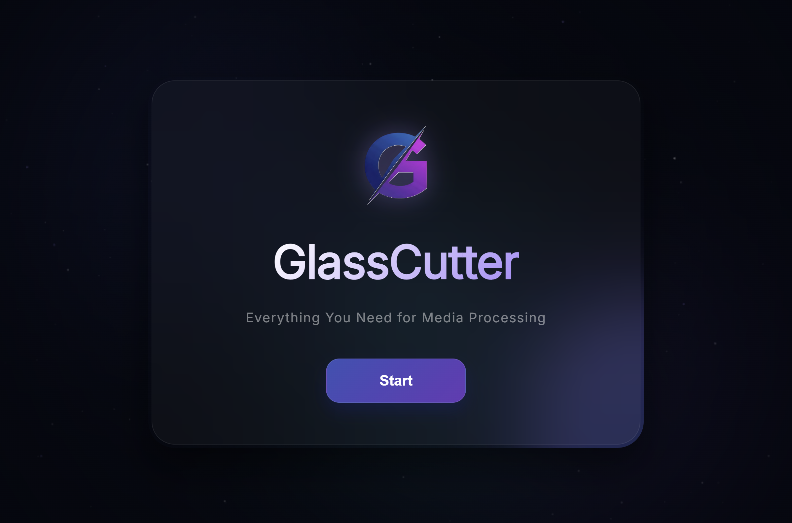

  

<h1 align="center">GlassCutter</h1>

  <strong>Simple & Fast & Powerful</strong>

  Everything You Need for Media Processing

  <a href="https://github.com/HosEynSH/GlassCutter/releases/tag/v1.0.0">
    <!--  -->
    
  </a>
  
  
  
  
  

## Introduction

GlassCutter is a modern desktop application for processing video, audio and images with speed and simplicity in mind. It brings together the most essential media tools in a clean, intuitive interface, allowing you to cut, convert, compress and transform files without the complexity of traditional editing software.
Powered by FFmpeg, FFprobe and Sharp, GlassCutter performs all processing locally on your computer—no internet connection, no cloud services and no additional dependencies required. Whether you need to quickly trim a video, convert audio formats or optimize images, GlassCutter helps you get the job done in just a few clicks.

## Why GlassCutter?

GlassCutter is built around one simple idea: **get from input to output as quickly as possible.**
Instead of overwhelming users with countless settings and complicated workflows, GlassCutter focuses on the tools people use most. The result is a clean, modern and intuitive experience that makes everyday media processing fast, accessible and reliable.
Whether you're compressing a video, converting audio, resizing an image or trimming a clip, GlassCutter helps you finish the job in just a few clicks.

## Features
GlassCutter includes **36 built-in tools**:
-  16 Video tools
-  13 Audio tools
-  7 Image tools

### Video

- Convert video formats and codecs
- Compress videos with optimized presets
- Trim videos without re-encoding
- Resize, crop, rotate and flip
- Extract audio from video
- Convert videos to GIF
- Adjust playback speed and frame rate
- Remove or normalize audio
- Burn subtitles (Hardsub)
- Analyze media information with FFprobe
- **and more...**

### Audio

- Convert audio formats
- Trim audio files
- Adjust bitrate and sample rate
- Change audio channels
- Control volume and normalize loudness
- Mix multiple audio tracks
- Bass boost and tempo adjustment
- Create ringtones
- Remove silence automaticall
- **and more...**

### Image
- Convert image formats
- Resize and compress images
- Rotate and flip images
- Apply color adjustments
- Merge multiple images
- **and more...**

  

  

---

## Demo

  

## Downloads

You can download the latest version of GlassCutter from the official GitHub Releases page:

 [Download Latest Release](https://github.com/HosEynSH/GlassCutter/releases/tag/v1.0.0)

---

### Available Packages

| Version   | Description |
|-----------|-------------|
| Installer | Smaller download, installs GlassCutter on your system with shortcuts and integration |
| Portable  | No installation required. Just extract and run anywhere |

---

### Notes

- Windows only (for now)
- Installer version requires setup
- Portable version runs immediately after extraction
- Both versions include FFmpeg bundled (no extra installation needed)

## Installation

### Installer Version

1. Download the setup file from the Releases page  
2. Run the installer  
3. Follow the installation steps  
4. Launch GlassCutter from Start Menu or Desktop shortcut  

---

### Portable Version

1. Download the portable ZIP file  
2. Extract it anywhere on your system  
3. Run `GlassCutter-Portable.exe`

## Supported Formats

### Video

**Input:**
mp4, mkv, avi, webm

**Output:**
mp4 (H.264), mkv, avi, webm

---

### Audio

**Input:**
mp3, wav, aac, flac, ogg, m4a, wma, m4r

**Output:**
mp3, wav, flac, aac

---

### Image

**Input:**
png, jpg, jpeg, webp, avif, tiff

**Output:**
png, jpeg, webp, avif

## FAQ

### Does GlassCutter require FFmpeg?
Yes. GlassCutter uses FFmpeg and FFprobe internally, but they are bundled with the application. No separate installation is required.

---

### Does GlassCutter work offline?
Yes. All processing is done locally on your computer. The app does not require an internet connection.

---

### Is GlassCutter portable?
Yes. A portable version is available that runs without installation. Just extract and run.

---

### Can I process multiple files?
Yes. You can process multiple files sequentially, but parallel processing is not currently supported.

## Privacy

GlassCutter processes all media locally on your device.

No files are uploaded, shared, or sent to any external server. Everything happens on your computer, ensuring full privacy and security.

**100% Offline Processing**  
Your media never leaves your system.

## Reporting Bugs

If you encounter any issues or unexpected behavior, please report it via the GitHub Issues page.

When reporting a bug, please include:

- GlassCutter version
- Windows version
- Steps to reproduce the issue
- Expected behavior
- Screenshots or screen recordings (if possible)

## Roadmap

Planned features for future releases:

- Batch processing (true parallel queue system)
- Drag & drop support
- Hardware acceleration (GPU encoding)
- Additional export formats
- Performance optimizations
- UI improvements and refinements
- macOS and Linux support (future consideration)

## Credits

GlassCutter is built using the following technologies:

-  Electron – Desktop application framework
-  FFmpeg – Media processing engine
-  FFprobe – Media analysis tool
-  Sharp – High-performance image processing library

## Copyright

Copyright © 2025 Shahrokh.

All rights reserved.
